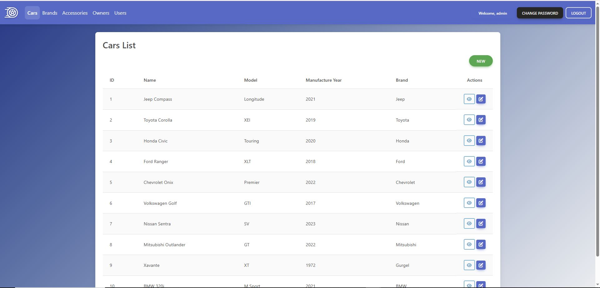
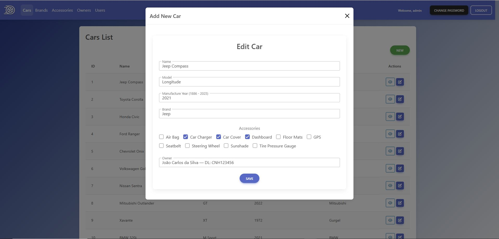
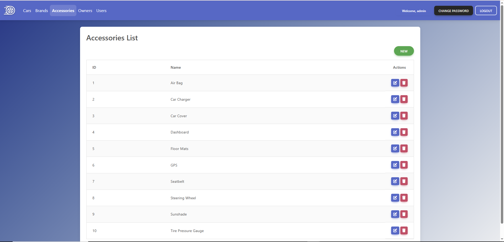
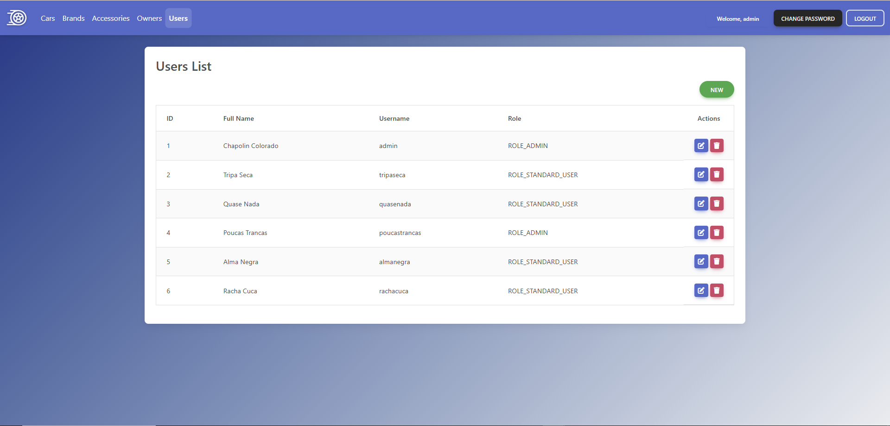

# Cars Management

**Cars Management** is a full-stack application designed to manage car sales, brands, accessories, and owners. Users can perform CRUD operations on cars, brands, owners, and accessories, with secure authentication and role-based permissions for admins.  

The application also includes **robust validation**, **centralized error handling**, and dynamic **frontend-backend integration**.

## How to Access the Project

The production stack is hosted across:

- **Backend:** Render ([https://cars-management-co0d.onrender.com](https://cars-management-co0d.onrender.com)) (hibernates on free tier)
- **Frontend:** Vercel ([https://cars-management-drab.vercel.app](https://cars-management-drab.vercel.app))
- **Database:** Aiven MySQL (free tier)
- **Deployment practice:** Initially deployed on AWS for learning, but the final production setup uses Render + Vercel + Aiven to avoid costs.

### Steps to run locally

1. Clone the repository:

```bash
git clone https://github.com/pitercoding/cars-management.git
cd cars-management
```

1. Backend:

```cmd
cd backend
mvnw spring-boot:run
```

```powershell
cd backend
.\mvnw spring-boot:run
```

```bash
cd backend
./mvnw spring-boot:run
```

1. Frontend:

```bash
cd frontend
npm install
ng serve
```

## Motivation

As a Computer Science student, this project was created to **practice full-stack development** by building a realistic management system.

It allowed me to apply concepts in **Spring Boot, Angular, REST APIs, authentication, database modeling, frontend UI/UX, and cloud deployment**.

## Learning Points

During development, I strengthened skills in:

- **Frontend:** Angular, TypeScript, SCSS, MDB Angular UI Kit, routing, HTTP interceptors.
- **Backend:** Spring Boot, Spring Security, JWT authentication, centralized exception handling.
- **Database:** MySQL, repository design, relationships.
- **Deployment & Cloud:** Experience deploying to AWS, then using Render (backend), Vercel (frontend), and Aiven (MySQL) for the final free-tier setup.
- **Testing & Validation:** Unit tests, code coverage with JaCoCo, frontend form validations.

---

## Application Structure

| Layer      | Technology              | Main Function                                                              |
| ---------- | ----------------------- | -------------------------------------------------------------------------- |
| Frontend   | Angular + TypeScript    | UI for managing cars, brands, owners, accessories with forms and lists     |
| Backend    | Spring Boot             | REST API with logging, authentication, validation, and exception handling  |
| Database   | SQL                     | Stores cars, owners, brands, accessories                                   |
| Auth       | JWT + Spring Security   | Secure login, admin role management, password change                       |
| Deployment | Render / Vercel / Aiven | Cloud deployment and hosting                                               |

---

## Technologies & Tools

### Frontend (Angular)

- Angular 15+  
- MDB Angular UI Kit  
- SCSS / CSS3  
- HTTP Client / Interceptor  
- Routing & Guards  
- Components for Cars, Owners, Brands, Accessories  

### Backend (Spring Boot)

- Spring Boot 3+  
- Spring Security + JWT  
- REST APIs (Cars, Brands, Owners, Accessories)  
- Centralized exception handling  
- Validation and logging  
- Repositories and Service layers with business rules  

### Database

- MySQL  
- Entity relationships: Many-to-Many (Cars ↔ Accessories), One-to-Many (Owner ↔ Cars, Brand ↔ Cars)  

### Deployment

- Backend deployed on Render  
- Frontend deployed on Vercel  
- Database hosted on Aiven MySQL (free tier)  
- Initial deployment practice on AWS (later replaced to avoid costs)

---

## Screenshots & Visuals

### Cars List



### Car Details Modal



### Brands & Accessories Management

  


### Authentication & User Management

  


---

## Application Flow

```text
User → Frontend (Angular)
↓
REST API (Spring Boot, JWT, Validation, Logs)
↓
Database (SQL)
↑
(Backend processes requests and returns results)
```

## Current Status

| Area           | Status         | Description                                                                      |
| -------------- | -------------- | -------------------------------------------------------------------------------- |
| Backend        | ✅ Completed   | CRUD, validation, auth, exception handling                                       |
| Frontend       | ✅ Completed   | Full management UI for cars, brands, owners, accessories                         |
| Integration    | ✅ Tested      | Frontend ↔ Backend communication via HTTP                                        |
| Database       | ✅ Operational | Connected and synchronized                                                       |
| Authentication | ✅ Implemented | JWT + Role-based UI + Password change                                            |
| Deployment     | ✅ Done        | Backend → Render, Frontend → Vercel, Database → Aiven, AWS deployment experience |

## Folder Structure

```bash
cars-management/
├─ backend/
│  ├─ src/main/java/com/cars/backend/
│  │  ├─ auth/                  # Authentication module (login, users, DTOs)
│  │  ├─ config/                # Security, CORS, JWT filters
│  │  ├─ controller/            # REST controllers
│  │  ├─ dto/                   # Data Transfer Objects
│  │  ├─ entity/                # JPA Entities
│  │  ├─ exception/             # Custom exceptions and handlers
│  │  ├─ repository/            # Spring Data JPA repositories
│  │  ├─ service/               # Business logic services
│  │  └─ BackendApplication.java
├─ frontend/
│  ├─ src/app/
│  │  ├─ auth/                  # Authentication components & services
│  │  ├─ components/            # CRUD components (cars, brands, owners, accessories)
│  │  ├─ models/                # TypeScript models
│  │  ├─ services/              # HTTP services
│  │  ├─ app.routes.ts          # Routing configuration
│  │  └─ app.ts/html/scss       # Main app files
│  ├─ assets/images/            # Logo and other static files
│  └─ environments/             # Environment configs (dev/prod)
├─ .gitignore
├─ README.md
└─ LICENSE
```

## License

This project is licensed under the **MIT License**.

## Author

**Piter Gomes** — Computer Science Student & Full-Stack Developer

[Email](mailto:piterg.bio@gmail.com) | [LinkedIn](https://www.linkedin.com/in/piter-gomes-4a39281a1/) | [GitHub](https://github.com/pitercoding) | [Portfolio](https://portfolio-pitergomes.vercel.app/)
