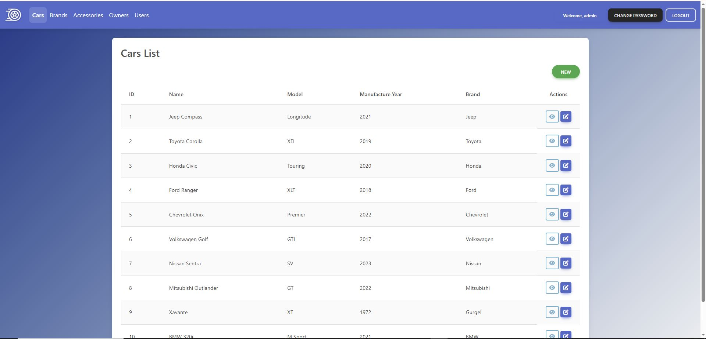
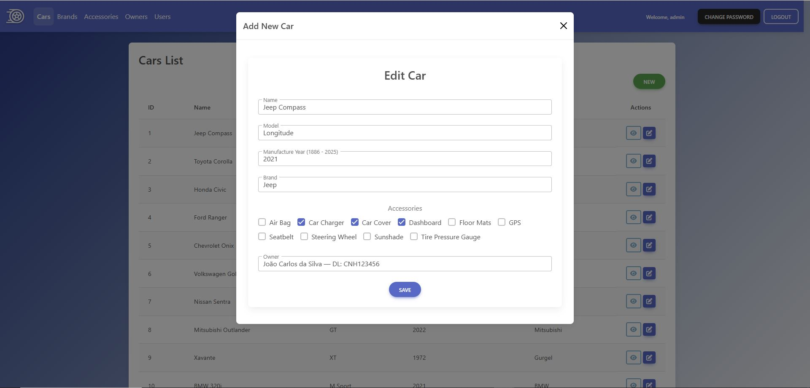
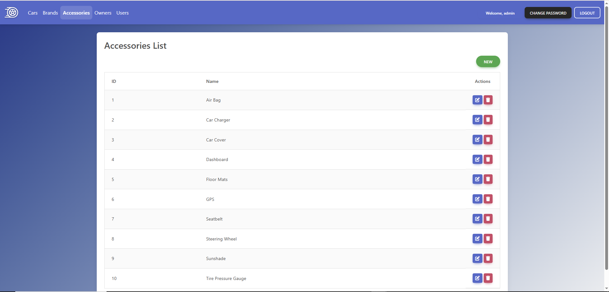
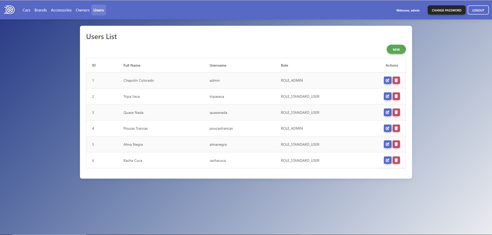

<h1 align="center">
  
  Cars Management
</h1>

<p align="center">
  🌎 <strong>Languages:</strong><br>
  <a href="README.pt.md">🇧🇷 Portuguese</a> |
  <a href="README.md">🇺🇸 English</a>
</p>

**Cars Management** é uma aplicação full-stack projetada para gerenciar vendas de carros, marcas, acessórios e proprietários. Os usuários podem realizar operações CRUD em carros, marcas, proprietários e acessórios, com autenticação segura e permissões baseadas em funções (RBAC) para administradores.

A aplicação também inclui **validação robusta**, **tratamento centralizado de erros** e uma **integração frontend-backend** dinâmica.

## 🚀 Como Acessar o Projeto

O stack de produção está hospedado em:

- **Backend:** Render (https://cars-management-co0d.onrender.com) (hiberna no plano gratuito)
- **Frontend:** Vercel (https://cars-management-drab.vercel.app)
- **Banco de dados:** Aiven MySQL (free tier)
- **Prática de deploy:** Inicialmente implantado na AWS para aprendizado, mas a produção final usa Render + Vercel + Aiven para evitar custos.

### Passos para rodar localmente

1. Clone o repositório:
```bash
git clone https://github.com/pitercoding/cars-management.git
cd cars-management
```
2. Backend:  
```bash
cd backend
./mvnw spring-boot:run
```
3. Frontend:  
```bash
cd frontend
npm install
ng serve
```

## 🏆 Motivação

Como estudante de Ciências da Computação, este projeto foi criado para **praticar o desenvolvimento full-stack** através da construção de um sistema de gerenciamento realista.

Ele me permitiu aplicar conceitos em **Spring Boot, Angular, APIs REST, autenticação, modelagem de banco de dados, UI/UX de frontend e implantação em nuvem (cloud deployment)**.

## 📚 Pontos de Aprendizado

Durante o desenvolvimento, fortaleci habilidades em:

- **Frontend:** Angular, TypeScript, SCSS, MDB Angular UI Kit, roteamento, interceptadores HTTP.
- **Backend:** Spring Boot, Spring Security, autenticação JWT, tratamento centralizado de exceções.
- **Banco de Dados:** MySQL, design de repositórios, relacionamentos.
- **Deploy & Nuvem:** Experiência na AWS e, no setup final gratuito, Render (backend), Vercel (frontend) e Aiven (MySQL).
- **Testes & Validação:** Testes unitários, cobertura de código com JaCoCo, validações de formulários no frontend.

---

## 🧱 Estrutura da Aplicação

| Camada     | Tecnologia            | Função Principal                                                                 |
|------------|-----------------------|----------------------------------------------------------------------------------|
| Frontend   | Angular + TypeScript  | UI para gerenciar carros, marcas, donos, acessórios com formulários e listas     |
| Backend    | Spring Boot           | API REST com logs, autenticação, validação e tratamento de exceções              |
| Banco de Dados | SQL               | Armazena carros, proprietários, marcas, acessórios                               |
| Autenticação | JWT + Spring Security | Login seguro, gerenciamento de cargos (admin), alteração de senha                |
| Deploy     | Render / Vercel / Aiven | Hospedagem e implantação em nuvem                                              |

---

## ⚙️ Tecnologias & Ferramentas

### Frontend (Angular)
- Angular 15+  
- MDB Angular UI Kit  
- SCSS / CSS3  
- HTTP Client / Interceptadores  
- Roteamento & Guards  
- Componentes para Carros, Proprietários, Marcas e Acessórios

### Backend (Spring Boot)
- Spring Boot 3+  
- Spring Security + JWT  
- APIs REST (Carros, Marcas, Proprietários, Acessórios)  
- Tratamento centralizado de exceções  
- Validação e logs  
- Camadas de Serviço e Repositório com regras de negócio

### Banco de Dados
- MySQL  
- Relacionamentos de entidades: Muitos-para-Muitos (Carros ↔ Acessórios), Um-para-Muitos (Proprietário ↔ Carros, Marca ↔ Carros)

### Deployment
- Backend implantado no Render  
- Frontend implantado na Vercel  
- Banco de dados hospedado no Aiven MySQL (free tier)  
- Prática inicial de deploy na AWS (substituída para evitar despesas)

---

## 🖼️ Screenshots & Visuais

### Lista de Carros


### Modal de Detalhes do Carro


### Gerenciamento de Marcas & Acessórios
  


### Autenticação & Gerenciamento de Usuários
  


---

## 🧭 Fluxo da Aplicação

```text
Usuário → Frontend (Angular)
↓
API REST (Spring Boot, JWT, Validação, Logs)
↓
Banco de Dados (SQL)
↑
(Backend processa as requisições e retorna os resultados)
```

## ✅ Status Atual

| Área           | Status        | Descrição                                             |
|----------------|---------------|------------------------------------------------------|
| Backend        | ✅ Concluído  | CRUD, validação, autenticação, tratamento de exceções |
| Frontend       | ✅ Concluído  | UI completa para gestão de carros, marcas, donos e acessórios |
| Integração     | ✅ Testada    | Comunicação Frontend ↔ Backend via HTTP              |
| Banco de Dados | ✅ Operacional| Conectado e sincronizado                             |
| Autenticação   | ✅ Implementada| JWT + UI baseada em cargos + Alteração de senha      |
| Deploy         | ✅ Concluído  | Backend → Render, Frontend → Vercel, Banco → Aiven, experiência com AWS |

## 📂 Estrutura de Pastas
```bash
cars-management/
├─ backend/
│  ├─ src/main/java/com/cars/backend/
│  │  ├─ auth/                  # Módulo de autenticação (login, usuários, DTOs)
│  │  ├─ config/                # Filtros de Segurança, CORS, JWT
│  │  ├─ controller/            # Controllers REST
│  │  ├─ dto/                   # Objetos de Transferência de Dados (DTOs)
│  │  ├─ entity/                # Entidades JPA
│  │  ├─ exception/             # Exceções personalizadas e manipuladores
│  │  ├─ repository/            # Repositórios Spring Data JPA
│  │  ├─ service/               # Serviços de lógica de negócio
│  │  └─ BackendApplication.java
├─ frontend/
│  ├─ src/app/
│  │  ├─ auth/                  # Componentes e serviços de autenticação
│  │  ├─ components/            # Componentes de CRUD (carros, marcas, donos, acessórios)
│  │  ├─ models/                # Modelos TypeScript
│  │  ├─ services/              # Serviços HTTP
│  │  ├─ app.routes.ts          # Configuração de rotas
│  │  └─ app.ts/html/scss       # Arquivos principais da aplicação
│  ├─ assets/images/            # Logo e outros arquivos estáticos
│  └─ environments/             # Configurações de ambiente (dev/prod)
├─ .gitignore
├─ README.md
└─ LICENSE
```

## 📜 **Licença**

Este projeto está sob a licença **MIT**.

## 🧑‍💻 Autor

**Piter Gomes** — Aluno de Ciências da Computação (5º Semestre) & Desenvolvedor Full-Stack

📧 [Email](mailto:piterg.bio@gmail.com) | 💼 [LinkedIn](https://www.linkedin.com/in/piter-gomes-4a39281a1/) | 💻 [GitHub](https://github.com/pitercoding) | 🌐 [Portfolio](https://portfolio-pitergomes.vercel.app/)
